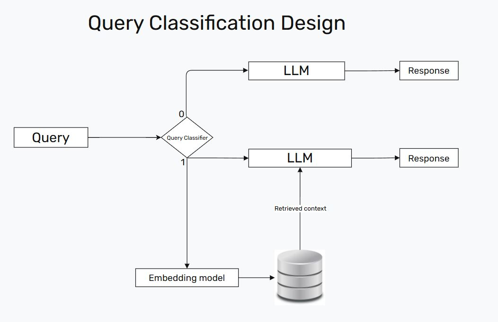

## **Query Classification for Retrieval Augmented Generation**

```
Not all queries require to be retrieval-augmented due to the inherent capabilities of LLMs. While RAG can enhance information accuracy and reduce hallucinations, frequent retrieval costs longerresponse time.
```
## 📄 [Источник]((https://aclanthology.org/2024.emnlp-main.981.pdf))


## 🛠 1. Дизайн системы:


📌 **Стек технологий MVP:**  
✅ **Qdrant** — векторная база данных  
✅ **Transformers** — модели для классификации и генерации  
✅ **BitsAndBytes** — квантизация LLM  
✅ **SentenceTransformer** — эмбеддинги запросов и чанков текста

## 2. Метрики

Основными метриками для алгоритма являются RAG Score, token-level F1 и средняя задержка на запрос. Тем не менее, поскольку проект является MVP, они здесь не трекались

## 3. Решение 

В рамках задачи рассматривались несколько подходов:

### 🔹 Классификация на основе ключевых слов. Ищет ключевые слова в запросе, по которым определяет, нужен ли RAG.

**Плюсы**:

- Не требует ML и имеет быстрый инференс

**Минусы**:

- Большое количество шума, невозможность охватить все случаи, изменчивость языка во времени


### 🔹 Классификация на основе классического ML (TF-IDF+бустинг)

**Плюсы**:

- Быстрая скорость

**Минусы**:

- Отсутствие учета семантики текста

### 🔹 Классификация с помощью дискриминативного трансформера

**Плюсы**:

- Наличие индуктивного смещения и семантики позволяет учесть больше случаев, не попавших в тренировочные данные

**Минусы**:

- Медленный инференс

Для MVP был выбран дискриминативный DistilBERT с разметкой данных на основе ключевых слов. Датасет - [Dolly15k](https://huggingface.co/datasets/databricks/databricks-dolly-15k) (раздел "instruction"). Для него представлен отдельный небольшой блокнот с EDA и Topic Modeling.

📌 **Альтернативный вариант** -  использовать **LLM для разметки данных**, так как модель знает, какие запросы ей понятны, а какие - нет.

## Варианты возможных улучшений:

- Улучшение промпта LLM, потому что в MVP он носит символический характер
- Ускорение инференса с помощью PagedAttention и vllm
- Поддержка взаимодействия клиент-сервер в Qdrant
- Разметка данных с применением LLM
- Трекинг метрик информационного поиска
- Более тщательный выбор и дообучение модели векторизации, тоже самое касается LLM
- Данные для векторной базы данных (в MVP не рассматривались)
